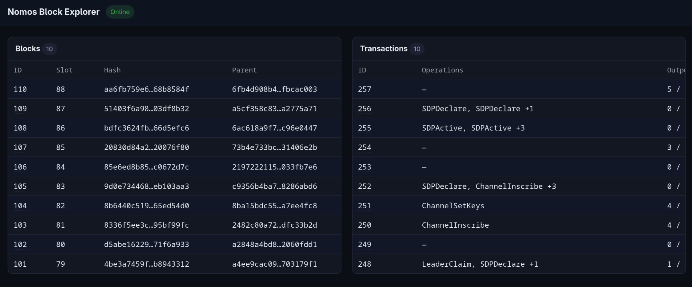
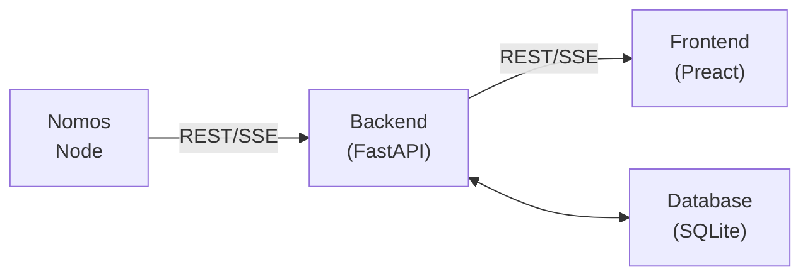

# Nomos Block Explorer

This is a Proof of Concept (PoC) for a block explorer for the Nomos blockchain.



## Features

- Frontend (React-like SPA)
  - Client-side routing with Home, Block, and Transaction pages.
    - Home: Live stream of the latest Blocks and Transactions.
    - Block: Details of a Block, including a list of its transactions.
    - Transaction: Details of a Transaction.
- Backend (FastAPI)
  - API
    - REST API to query Blocks and Transactions.
    - SSE API to stream live Blocks (and its transactions).
  - Node Management
    - Pluggable API (e.g. `fake`, `http`) to query nodes.
    - Pluggable Manager (e.g. `noop`, `docker`) to manage local nodes.
  - Simple backfilling mechanism to populate historical blocks.

## Architecture

The Nomos Block Explorer follows a three-tier architecture with a clear separation of concerns:

### High-Level Overview



### Components

#### 1. Frontend (`/static`)
- **Framework**: Preact (lightweight React alternative)
- **Routing**: Client-side SPA routing
- **Architecture**: Component-based with functional components
- **Communication**: REST API calls and Server-Sent Events (SSE) for real-time updates

#### 2. Backend (`/src`)
- **Framework**: FastAPI (Python async web framework)
- **API Layer** (`/src/api`): Serializers, REST and streaming endpoints
- **Core** (`/src/core`): Application setup, configuration, base types and mixins
- **Database Layer** (`/src/db`): Repository pattern for data access
- **Models** (`/src/models`): Domain models (Block, Transaction, Header, etc.)
- **Node Integration** (`/src/node`):
  - **API**: Pluggable adapters to communicate with Nomos nodes (`fake`, `http`) and serializers
  - **Manager**: Pluggable node lifecycle management (`noop`, `docker`)

#### 3. Data Flow

1. **Node Updates**: On startup, the backend starts listening for new blocks from the node and stores them in the database
2. **Backfilling**: After at least one block is in the database, the backend fetches historical blocks from the node and stores them
3. **Client Updates**: Frontend subscribes to SSE endpoints for real-time block and transaction updates
4. **Data Access**: All queries route through repository classes for consistent data access

#### 4. Key Design Patterns

- **Repository Pattern**: Abstraction layer for database operations (`BlockRepository`, `TransactionRepository`)
- **Strategy Pattern**: Pluggable Node API implementations (fake for testing, HTTP for production)
- **Adapter Pattern**: Serializers convert between Node API formats and internal domain models
- **Observer Pattern**: SSE streams for pushing real-time updates to clients


## Requirements

- Python 3.14
- UV Package Manager

### Optional

- Docker: To run a local node.

## How to run

1. Install the dependencies:
   ```bash
   uv sync
   ```

2. Run the block explorer:
   ```bash
   python src/main.py
   ```

- You can optionally run it via Docker with:
    ```bash
    docker build -t nomos-block-explorer . && docker run -p 8000:8000 nomos-block-explorer
    ```

- If you want to run the Explorer without a Node, make sure to set the `NBE_NODE_API` environment variable to `fake`:
    1. ```bash
       NBE_NODE_API=fake python src/main.py
       ```
    2. ```bash
       docker run -e NBE_NODE_API=fake -p 8000:8000 nomos-block-explorer
       ```

### Configuration

The block explorer is configured through environment variables. The following variables are available:
```dotenv
NBE_LOG_LEVEL=DEBUG  # DEBUG, INFO, WARNING, ERROR, CRITICAL

NBE_DEBUG=true  # Randomizes transactions in BlockSerializer

NBE_NODE_MANAGER=noop  # noop, docker
NBE_NODE_COMPOSE_FILEPATH=/path/to/docker-compose.yml  # Only used if NODE_MANAGER=docker

NBE_NODE_API=http  # fake, http
NBE_NODE_API_HOST=localhost  # Only used if NODE_API=http
NBE_NODE_API_PORT=18080  # Only used if NODE_API=http
NBE_NODE_API_TIMEOUT=60  # Only used if NODE_API=http
NBE_NODE_API_PROTOCOL=http  # Only used if NODE_API=http

NBE_HOST=0.0.0.0  # Block Explorer's listening host
NBE_PORT=8000  # Block Explorer's listening port
```
If running the Block Explorer with Docker, these can be overridden.

## Considerations

This PoC makes simplifications to focus on the core features:
- Each slot has exactly one block.
- When backfilling, the block explorer will only backfill from the earliest block's slot to genesis.

## Ideas and improvements

- Fix aforementioned assumptions
- Backfilling
  - Make requests concurrently
  - Backfill all slots
  - Upsert received blocks and transactions
- Database
  - Update to Postgres
  - Add migrations management
  - Add relevant indexes to columns
- Add interfaces to database repositories: `BlockRepository` and `TransactionRepository`
- Add tests
- Colour logs by level
- Reconnections
  - Failures to connect to Node
  - Timeouts
  - Stream closed
- Frontend
  - Add a block / transaction search barImprove
  - Make pages work with block/transaction hash, rather than the `id`
- Error handling
  - Exceptions raised within async code pop up as ugly stack traces
  - Better error messages
- Remove DB IDs from API responses and use hashes instead
